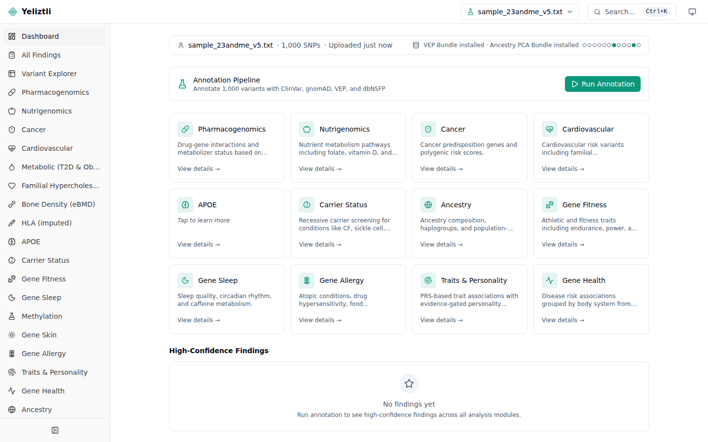

<p align="center">
  
</p>

# Yeliztli

[](https://github.com/bioedca/Yeliztli/actions/workflows/ci.yml)
[](LICENSE)
[](https://bioedca.github.io/Yeliztli/)
[](https://github.com/bioedca/Yeliztli/discussions)

**Privacy-first personal-genomics analysis platform — it runs entirely on your own machine.**

Upload the raw data file from a consumer genotyping service (**23andMe** or **AncestryDNA**),
and Yeliztli annotates your variants against public clinical and population databases and
organises the results into focused analysis modules — pharmacogenomics, ancestry, carrier
status, hereditary-risk panels, wellness traits, and more. **Your genome never leaves your
computer**: Yeliztli runs on `localhost` with no cloud processing and no outbound variant
data — your genotypes are never uploaded. (It does make a few non-genomic connections by
default, such as an app-version check; see [Privacy & data handling](docs/privacy.md) for the
full accounting.)



> [!WARNING]
> **Not medical advice.** Yeliztli is for **research and educational use only**. It analyses
> consumer genotyping-array data, which is **not a clinical-grade test** — results are **not
> diagnostic** and **not clinically validated**. Don't make medical decisions based on them.
> See **[Intended use & disclaimers](docs/intended-use.md)**.

## 📖 Documentation

**Full documentation site: <https://bioedca.github.io/Yeliztli/>**

- **[Getting started](docs/getting-started/index.md)** — install, upload your DNA, read your results
- **[Install & self-host](docs/install/index.md)** — native, Docker, configuration, troubleshooting
- **[Module reference](docs/modules/index.md)** — what every analysis module reports and how to read it
- **[Develop](docs/develop/index.md)** — architecture and contributor guide

## Quick start (development)

```bash
git clone https://github.com/bioedca/Yeliztli.git
cd Yeliztli
pip install -e ".[dev]"
cd frontend && npm install && cd ..
make dev
```

Open <http://localhost:5173> — the setup wizard guides you through first-run configuration.
For native services, Docker, and WSL2, see the **[install guide](docs/install/index.md)**.

## Requirements

- **Python 3.12+**, **Node 20+**
- At least ~60 GB free disk for full reference setup; ~80 GB recommended for headroom
- macOS, Linux, or Windows via **WSL2**; **Java 8+** optional for Tier-2 ancestry

## Contributing & community

Contributions are welcome. See **[CONTRIBUTING.md](CONTRIBUTING.md)** for the workflow, the
**[Code of Conduct](CODE_OF_CONDUCT.md)**, and **[GOVERNANCE.md](GOVERNANCE.md)** for how
decisions are made.

- 🐞 Bugs & features → **[open an issue](https://github.com/bioedca/Yeliztli/issues/new/choose)**
- 💬 Usage questions → **[Discussions → Q&A](https://github.com/bioedca/Yeliztli/discussions/categories/q-a)**
- 🔒 Security → **[SECURITY.md](SECURITY.md)** (report privately)
- ❓ Getting help → **[SUPPORT.md](SUPPORT.md)**

> Yeliztli is privacy-first — never paste raw genotype data or attach your genome file to a
> public issue or discussion.

## License & attribution

Yeliztli's code is released under the **[MIT license](LICENSE)**. To cite it, use
**[CITATION.cff](CITATION.cff)** (GitHub's "Cite this repository"). It annotates against several
public datasets, each retained under its own license — see **[NOTICE](NOTICE)** and the
**[attribution page](docs/attribution.md)**.
